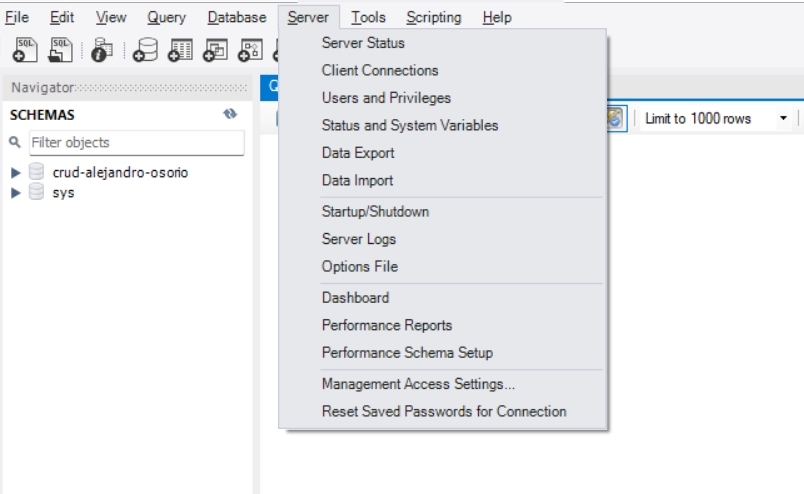
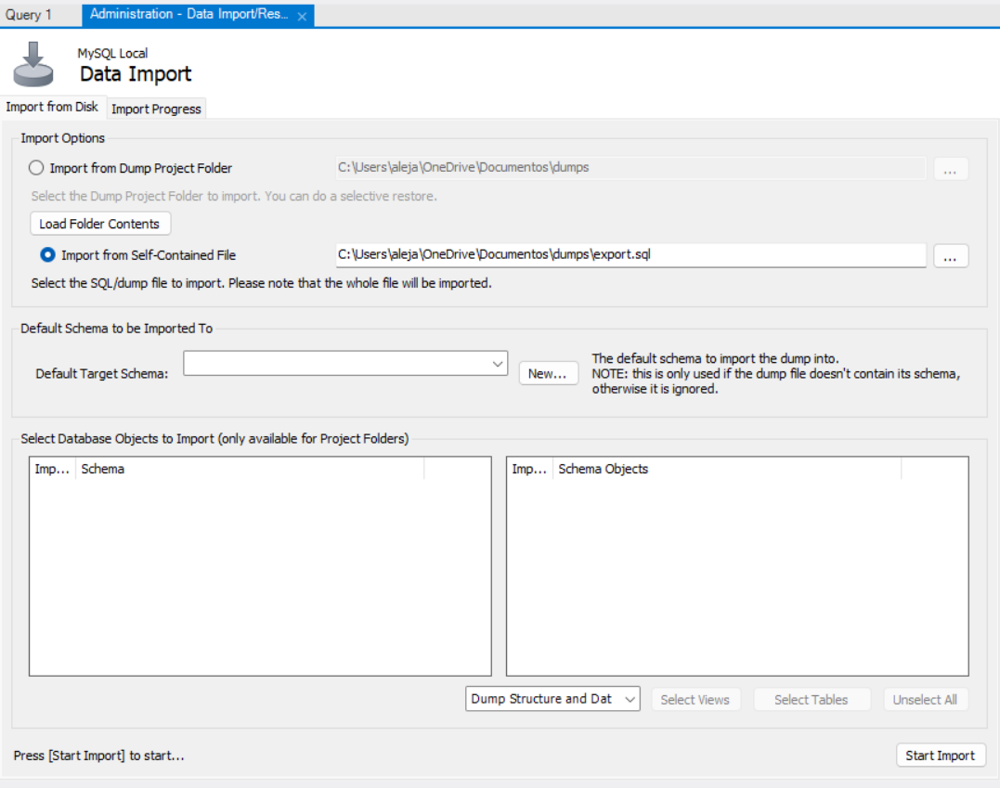

# Prueba Tecnica Helppeople
### Alejandro Osorio

Este repositorio contiene un proyecto completo con **frontend** (React + Ant Design), **backend** (API) y **base de datos en MySQL** para administrar **categorías** y **productos** con paginación, filtros y CRUD.

---

## Requisitos

Para ejecutar este proyecto es necesario contar con:

- **Node.js 18 o superior**
- **MySQL**
- **Workbench**

---

## Como crear la base de datos.
Dentro de la carpeta `/database` se encuentran los scripts necesarios para crear la base de datos y sus tablas.

### pasos 
1. Abrir Workbech y crear una nueva conexión o usar una ya existente. Debe tener las mismas variables de entonrno de la imagen preferiblemente o simplemente cambiarlas posteriormente en el archivo `.env` (sin password).


2. Seleccionar la opción `server/data import` que se encuentra en el menu superior.


3. Seleccionar la siguiente opción: (`import from Self-Contained File`)


4. Finalmente ahí mismo selecionar el archivos .sql y click en `new` en `Default Target Schema`, y agregar el nombre de la base de datos: **crud-alejandro-osorio**.

---

## Variables de entorno

Crear un archivo `.env` dentro de la carpeta **backend** y **frontend** con el siguiente contenido:

- backend/.env
```
PORT=4000
NODE_ENV=development

DB_HOST=127.0.0.1
DB_PORT=3306
DB_USER=root
DB_PASSWORD=
DB_NAME=crud-alejandro-osorio

CORS_ORIGIN=http://localhost:5173
```

tambien en frontend
- frontend/.env

```
VITE_API_URL=http://localhost:4000
```

---

## Como ejecutar el backend y frontend

- en backend abrir una terminal y ejecutar:

```
npm install
npm run dev
```

- en frontend abrir una terminal y ejecutar:

```
npm install
npm run dev
```


---


## Documentación de la API (postman)

### Archivos incluidos
- `postman/PruebaTecnica-Helppeople-AlejandroOsorio.postman_collection.json`
- `postman/Local-Helppeople.postman_environment.json`

---

NOTA: Para cargar los productos masivamente usar la plantilla que se envuentra en **database/plantilla.xlsx** y reemplazar los valores.